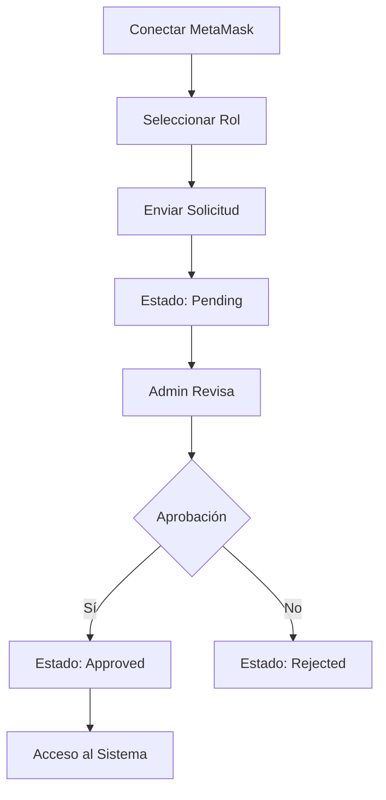
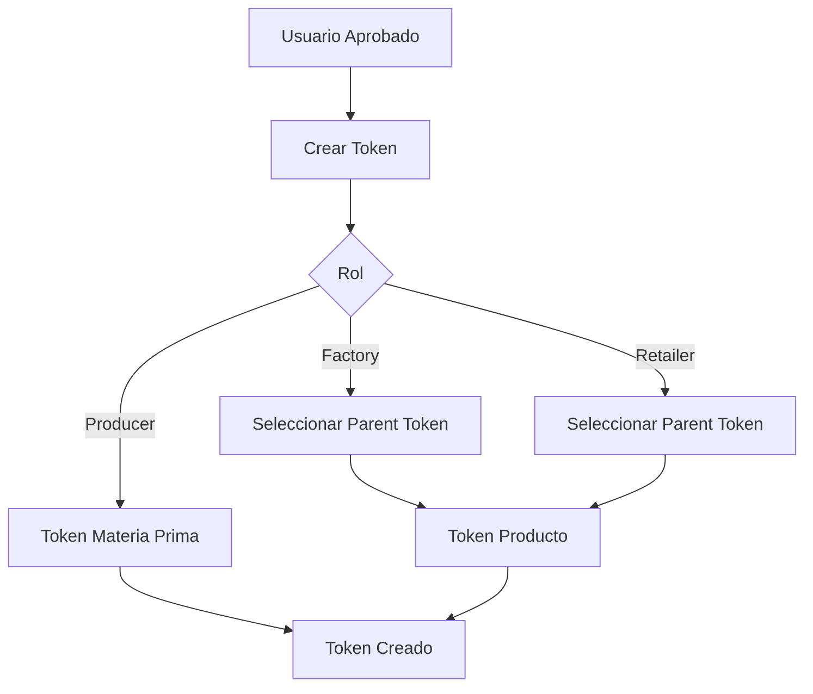
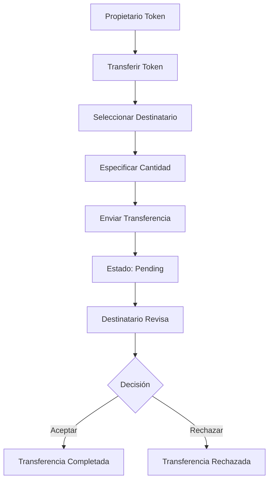

# 02_PROYECTO_IMPLEMENTADO_Y_ANALISIS

# 🔗 Supply Chain Tracker - Proyecto de Desarrollo Blockchain

## 🚀 Inicio Rápido

Para iniciar el sistema rápidamente, se ha creado una guía técnica detallada con todos los pasos de instalación y configuración. Consulta **[03_GUIA_TECNICA_INSTALACION.md](./03_GUIA_TECNICA_INSTALACION.md)** para mayor detalle sobre cómo levantar el sistema completo.

### 📖 Documentación Disponible

- **[CASOS_DE_USO.md](./CASOS_DE_USO.md)** - Casos de uso del sistema, pruebas y errores documentados
- **[01_PROYECTO_A_IMPLEMENTAR.md](./01_PROYECTO_A_IMPLEMENTAR.md)** - Especificaciones del proyecto a implementar
- **[03_GUIA_TECNICA_INSTALACION.md](./03_GUIA_TECNICA_INSTALACION.md)** - Guía técnica de instalación
- **[04_CASOS_DE_USO.md](./04_CASOS_DE_USO.md)** - Casos de uso adicionales
- **[05_IA.md](./05_IA.md)** - Documentación sobre el uso de IA en el proyecto

---


### 🌐 **Estructura Real del Proyecto y Páginas Principales**

#### Backend (Smart Contracts)
```
backend/
├── src/
│   ├── SupplyChain.sol
│   └── SupplyChainHelper.sol
├── script/
│   └── Deploy.s.sol
├── test/
│   └── SupplyChain.t.sol
├── foundry.toml
├── broadcast/
├── cache/
├── out/
```

#### Frontend (Next.js)
```
web3-starter/
├── src/
│   ├── app/
│   │   ├── page.tsx                # Landing/Login/Register
│   │   ├── layout.tsx              # Layout principal con Web3Provider
│   │   ├── dashboard/page.tsx      # Dashboard según rol
│   │   ├── tokens/
│   │   │   ├── page.tsx            # Lista de tokens del usuario
│   │   │   ├── create/page.tsx     # Crear nuevo token
│   │   │   └── [id]/page.tsx       # Detalles del token
│   │   ├── transfers/page.tsx      # Gestión de transferencias
│   │   ├── admin/
│   │   │   └── users/page.tsx      # Gestión de usuarios (solo admin)
│   │   ├── reset/page.tsx          # Reset de sistema (opcional)
│   ├── components/
│   │   ├── Header.tsx
│   │   ├── TokenCard.tsx
│   │   ├── TokenTraceabilityTree.tsx
│   │   ├── TokenTraceabilityLinear.tsx
│   │   ├── TransferList.tsx
│   │   ├── UserTable.tsx
│   │   └── ui/                     # Componentes base (shadcn/ui)
│   ├── contexts/Web3Context.tsx
│   ├── hooks/useWallet.ts
│   ├── lib/contractService.ts
│   ├── lib/requestHistoryService.ts
│   ├── lib/web3.ts
│   ├── contracts/config.ts
│   ├── contracts/SupplyChain.json
│   ├── types/
├── package.json
├── tailwind.config.js
├── .env.example
├── public/
```

#### Documentación y Presentación
```
Doc/
├── 01_PROYECTO_A_IMPLEMENTAR.md
├── 02_PROYECTO_IMPLEMENTADO_Y_ANALISIS.md
├── 03_GUIA_TECNICA_INSTALACION.md
├── 04_CASOS_DE_USO.md
├── 05_IA.md
├── PresentacionProyectoFinalSolidity.pptx
```

#### Otros
```
RESTART-ALL.ps1   # Script para reiniciar todo el sistema
README.md         # Guía principal del proyecto
```

**Páginas principales implementadas:**
- `/` (Landing, login y registro de usuario)
- `/dashboard` (Panel principal según rol)
- `/tokens` (Listado de tokens del usuario)
- `/tokens/create` (Creación de tokens)
- `/tokens/[id]` (Detalle de token)
- `/transfers` (Gestión y aceptación/rechazo de transferencias)
- `/admin/users` (Gestión de usuarios, solo admin)
- `/reset` (Reset del sistema, opcional)

**Componentes clave:**
- Header, TokenCard, TokenTraceabilityTree, TokenTraceabilityLinear, TransferList, UserTable, Web3Context, useWallet, contractService

**Presentación:**
- Archivo PPTX en la carpeta Doc: `PresentacionProyectoFinalSolidity.pptx`

## 1. Roles del Sistema

### 1.1 Roles Disponibles

| Rol | ID | Descripción | Permisos |
|-----|----|-----------|---------| 
| **Admin** | 0 | Administrador del sistema | Control total: aprobar/rechazar usuarios, cambiar roles, gestionar permisos |
| **Producer** | 1 | Productor de materias primas | Crear y gestionar productos iniciales en la cadena |
| **Factory** | 2 | Procesador/Fabricante | Transformar materias primas en productos |
| **Retailer** | 3 | Distribuidor/Minorista | Distribución y venta de productos |
| **Consumer** | 4 | Consumidor final | Consultar trazabilidad de productos |

### 1.2 Restricciones de Roles
- ✅ Usuarios pueden solicitar: Producer, Factory, Retailer, Consumer
- ❌ Rol Admin NO puede ser solicitado por usuarios (solo asignado por contrato)
- ✅ Solo existe UN admin por contrato (Account #0 de Anvil en desarrollo)

---

### 2.1 Máquina de Estados

```
┌──────────┐
│          │
│  NUEVO   │ (No registrado)
│          │
└────┬─────┘
     │ requestUserRole()
     ▼
┌──────────┐
│          │
│ PENDING  │ ◄────────────┐
│          │              │
└────┬─────┘              │
     │                    │
     │                    │ (Re-solicitar)
     ├─────────┬──────────┤
     │         │          │
     ▼         ▼          │
┌─────────┐ ┌──────────┐ │
│         │ │          │ │
│APPROVED │ │ REJECTED │─┘
│         │ │          │
└────┬────┘ └──────────┘
     │
     │ cancelMyAccount()
     ▼
┌──────────┐
│          │
│ CANCELED │ (Terminal)
│          │
└──────────┘
```

### 2.2 Descripción de Estados

| Estado | Valor | Descripción | Estado Terminal |
|--------|-------|-------------|----------------|
| **Pending** | 0 | Usuario registrado esperando aprobación del admin | No |
| **Approved** | 1 | Usuario activo con permisos completos | No |
| **Rejected** | 2 | Usuario rechazado por admin | No |
| **Canceled** | 3 | Usuario canceló su cuenta o fue dado de baja | Sí |

---

## 🛠️ Prerequisitos e Instalación

Para información detallada sobre prerequisitos, instalación y configuración del sistema, consulta la **[Guía Técnica de Instalación](./03_GUIA_TECNICA_INSTALACION.md)**:

- **[📋 Requisitos para configurar el Sistema](./03_GUIA_TECNICA_INSTALACION.md#-requisitos-para-configurar-el-sistema)** - Node.js, Git, Foundry, MetaMask
- **[🔧 Configuración del Entorno](./03_GUIA_TECNICA_INSTALACION.md#-configuración-del-entorno)** - Clonar repositorio, configurar smart contracts, frontend, variables de entorno y MetaMask
- **[🏁 Instalación Completa (Primera Vez)](./03_GUIA_TECNICA_INSTALACION.md#-instalación-completa-primera-vez)** - Guía paso a paso para primera instalación
- **[🚀 Inicio Rápido](./03_GUIA_TECNICA_INSTALACION.md#-inicio-rápido)** - Comandos rápidos para usuarios experimentados

---


## 🔄 Flujos de Trabajo

### 1. **Registro de Usuario**


### 2. **Creación de Token**


### 3. **Transferencia**


---

## 📊 Estructuras de Datos a Implementar


## ⚠️ Errores Comunes y Soluciones

### 🚨 **Problemas de Conexión**

**Error**: "MetaMask not detected"
```typescript
// Solución: Verificar que MetaMask esté instalado
if (typeof window.ethereum === 'undefined') {
  alert('Please install MetaMask!');
  return;
}
```

**Error**: "Wrong network"
```typescript
// Solución: Verificar chain ID
const chainId = await window.ethereum.request({ method: 'eth_chainId' });
if (parseInt(chainId, 16) !== 31337) {
  alert('Please connect to Anvil network (Chain ID: 31337)');
}
```

### 🚨 **Problemas de Smart Contract**

**Error**: "Contract not deployed"
```bash
# Solución: Verificar que Anvil esté corriendo y redesplegar
anvil & # En un terminal
forge script script/Deploy.s.sol --rpc-url http://localhost:8545 --private-key 0x... --broadcast
```

**Error**: "Transaction reverted"
```solidity
// Causa común: Usuario no aprobado
// Solución: Verificar status del usuario en /admin/users
```

### 🚨 **Problemas de Frontend**

**Error**: Next.js params Promise
```tsx
// ❌ Incorrecto en Next.js 15+
function Page({ params }: { params: { id: string } }) {
  const id = params.id; // Error
}

// ✅ Correcto
import { use } from 'react';
function Page({ params }: { params: Promise<{ id: string }> }) {
  const { id } = use(params);
}
```

**Error**: "localStorage is not defined"
```typescript
// Solución: Verificar que estamos en el cliente
if (typeof window !== 'undefined') {
  localStorage.setItem('key', 'value');
}
```

---

## 🧪 Testing y Validación

### **Tests de Smart Contract**
```bash
cd sc

# Ejecutar todos los tests
forge test

# Test específico con verbosidad
forge test --match-test testCreateToken -vvv

# Test con coverage
forge coverage
```

### **Validación de Frontend**
```bash
cd web

# Build de producción (detecta errores de tipos)
npm run build

# Linting
npm run lint

# Desarrollo con hot reload
npm run dev
```

### **Casos de Prueba Recomendados**

1. **Flujo completo de usuario**:
   - Registrarse como Producer
   - Crear token de materia prima
   - Transferir a Factory
   - Factory crea producto derivado
   - Continuar hasta Consumer

2. **Validación de permisos**:
   - Intentar transferir a rol incorrecto
   - Crear token sin estar aprobado
   - Acceder a páginas de admin sin permisos

3. **Estados de transferencia**:
   - Aceptar transferencia
   - Rechazar transferencia
   - Verificar actualización de balances

---

## 🎓 Plan de Desarrollo para Estudiantes

### **🚀 FASE 1: FUNDAMENTOS (OBLIGATORIO)**
1. **Configurar entorno de desarrollo**
   - Instalar Node.js, Foundry, MetaMask
   - Crear estructura de carpetas del proyecto
   - Configurar Anvil para blockchain local

2. **Desarrollar Smart Contract**
   - Programar `SupplyChain.sol` con todas las estructuras
   - Implementar todas las funciones requeridas
   - **✅ GOAL**: Todos los tests deben pasar con `forge test`

3. **Crear Frontend Base**
   - Configurar Next.js con TypeScript y Tailwind
   - Implementar Web3Provider con localStorage
   - Crear todas las páginas básicas

### **🔥 FASE 2: FUNCIONALIDAD CORE (OBLIGATORIO)**
4. **Sistema de Autenticación**
   - Conectar con MetaMask
   - Registro de usuarios por roles
   - Panel de admin para aprobaciones

5. **Gestión de Tokens**
   - Crear tokens con metadatos
   - Sistema de parentesco (productos de materias primas)
   - Visualización de tokens por usuario

6. **Sistema de Transferencias**
   - Transferir tokens entre roles
   - Sistema de aceptación/rechazo
   - Trazabilidad completa

---

## 📚 Recursos Adicionales

### **Documentación Oficial**
- [Solidity Docs](https://docs.soliditylang.org/)
- [Foundry Book](https://book.getfoundry.sh/)
- [Next.js Docs](https://nextjs.org/docs)
- [Ethers.js Docs](https://docs.ethers.org/)

### **Tutoriales Recomendados**
- [CryptoZombies](https://cryptozombies.io/) - Aprender Solidity
- [Buildspace](https://buildspace.so/) - Proyectos Web3
- [Next.js Tutorial](https://nextjs.org/learn) - React y Next.js

### **Herramientas de Desarrollo**
- [Remix IDE](https://remix.ethereum.org/) - Editor Solidity online
- [Hardhat](https://hardhat.org/) - Alternativa a Foundry
- [OpenZeppelin](https://openzeppelin.com/) - Contratos seguros

---

## ✅ Checklist de Desarrollo

### **🔧 CONFIGURACIÓN INICIAL**
- [ ] Node.js (18+) y npm instalados y verificados
- [ ] Foundry instalado (`curl -L https://foundry.paradigm.xyz | bash`)
- [ ] MetaMask instalado y configurado
- [ ] Estructura de carpetas creada desde cero
- [ ] Anvil corriendo en puerto 8545

### **⚡ SMART CONTRACT**
- [ ] `SupplyChain.sol` programado con todas las estructuras
- [ ] Enums `UserStatus` y `TransferStatus` definidos
- [ ] Structs `Token`, `Transfer`, `User` implementados
- [ ] Todas las funciones públicas programadas
- [ ] Modificadores de acceso implementados
- [ ] Script de deploy `Deploy.s.sol` creado
- [ ] Tests unitarios escritos y **TODOS PASANDO** ✅
- [ ] Contrato desplegado exitosamente en Anvil

### **🌐 FRONTEND**
- [ ] Proyecto Next.js inicializado con TypeScript
- [ ] Dependencias instaladas (ethers, tailwind, radix-ui)
- [ ] `Web3Context` programado con localStorage
- [ ] Hook `useWallet` implementado
- [ ] Servicio `Web3Service` creado
- [ ] Configuración del contrato actualizada
- [ ] Todas las páginas creadas y funcionando:
  - [ ] `/` - Landing con conexión MetaMask
  - [ ] `/dashboard` - Panel principal
  - [ ] `/tokens` y `/tokens/create` - Gestión tokens
  - [ ] `/tokens/[id]` y `/tokens/[id]/transfer` - Detalles y transferencias
  - [ ] `/transfers` - Transferencias pendientes
  - [ ] `/admin` y `/admin/users` - Panel administración
  - [ ] `/profile` - Perfil usuario
- [ ] Header con navegación implementado
- [ ] Componentes UI base creados

### **🔗 INTEGRACIÓN**
- [ ] Conexión MetaMask funcionando
- [ ] Registro de usuarios por rol implementado
- [ ] Aprobación por admin operativa
- [ ] Creación de tokens con metadatos
- [ ] Sistema de transferencias completo
- [ ] Aceptar/rechazar transferencias funcionando
- [ ] Trazabilidad de productos visible
- [ ] Persistencia en localStorage implementada

### **📱 FUNCIONALIDAD COMPLETA**
- [ ] Flujo completo Producer→Factory→Retailer→Consumer
- [ ] Validaciones de permisos por rol
- [ ] Estados visuales correctos (pending, approved, etc.)
- [ ] Manejo de errores implementado
- [ ] Design responsive funcionando
- [ ] Build de producción sin errores


### **🎯 ENTREGA FINAL**
- [ ] **Demo funcionando completamente** 🎉
- [ ] Repositorio publico con workflow de testing.
- [ ] README con instrucciones de instalación
- [ ] Video demo de maximo 5 minutos


---

## 🤝 Soporte y Comunidad

### **💡 Tips para el Desarrollo**
- **Commits frecuentes** con mensajes descriptivos
- **Testing exhaustivo** - los tests son tu red de seguridad
- **Debugging metódico** - usa console.log y Foundry traces
- **Documentar decisiones** en comentarios del código
- **Backup de private keys** de prueba (nunca usar en mainnet)

### **🆘 Cuando Necesites Ayuda**
1. **Revisa este README** - contiene toda la información necesaria
2. **Consulta la documentación oficial** de las tecnologías
3. **Utiliza los debugging tools** de Foundry y Chrome DevTools
4. **Verifica configuraciones** - 90% de los errores son de setup
5. **Tests primero** - si el test pasa, el problema está en frontend

### **🎯 Criterios de Evaluación (Total: 10 puntos)**

#### **📊 DISTRIBUCIÓN DE PUNTOS**

**🔥 SMART CONTRACT (4.0 puntos)**
- **Estructuras y Funciones** 
- **Tests Unitarios** 
- **Deploy y Configuración** 

**🌐 FRONTEND (3.0 puntos)**
- **Páginas y Navegación** 
- **Integración Web3** 
- **UI/UX y Componentes** 
- **Flujo Completo de Usuario** 
- **Trazabilidad y Permisos**

**📝 CALIDAD DEL CÓDIGO (0.5 puntos)**
- **Organización y Limpieza** 
- **Documentación**

#### **⭐ EXTRAS 1 puntos**
- **Calidad Excepcional** 
  - Tests de frontend implementados
  - Manejo de errores robusto
  - Performance optimizada
- **Deploy en testnet**
  - Deploy en testnet real

#### **⭐ PRESENTACION VIDEO DE MAXIMO 5 MINUTOS (1.5 punto) **
- **Presentación video**
- **Demo funcionando completamente**


#### **❌ PENALIZACIONES**
- **Tests fallando**: -1.0 pt por cada test crítico que falle
- **Aplicación no funcional**: -2.0 pts si no se puede ejecutar
- **Smart contract sin deploy**: -1.5 pts
- **Sin conexión MetaMask**: -1.0 pt
- **Código sin comentarios**: -0.5 pts

#### **📋 MÍNIMO PARA APROBAR: 6.0/10**
Para obtener la nota mínima de aprobación debes cumplir:
- ✅ Smart contract deployado y con tests básicos pasando
- ✅ Frontend conectando con MetaMask
- ✅ Al menos 3 páginas principales funcionando
- ✅ Flujo básico de registro y tokens operativo

### **🏆 Objetivos de Aprendizaje Alcanzados**
Al completar este proyecto habrás aprendido:
- ✅ **Solidity** - Programación de smart contracts
- ✅ **Foundry** - Testing y deployment de contratos
- ✅ **Next.js/React** - Desarrollo frontend moderno
- ✅ **Web3 Integration** - Conexión blockchain con frontend
- ✅ **DApp Architecture** - Diseño de aplicaciones descentralizadas
- ✅ **Testing** - Estrategias de testing en blockchain
- ✅ **UX/UI** - Diseño de interfaces crypto-friendly

---

### Seguridad y Buenas Prácticas

### 9.1 Validaciones Implementadas

✅ **Control de acceso basado en roles**
- Solo admin puede aprobar/rechazar
- Usuarios solo pueden gestionar su propia cuenta

✅ **Validación de transiciones de estado**
- Máquina de estados estricta
- No se permiten saltos de estado inválidos

✅ **Protección del admin**
- Admin no puede ser rechazado
- Admin no puede cancelar su cuenta
- Admin no puede cambiar su propio rol

✅ **Prevención de doble registro**
- Usuario solo puede tener una cuenta activa (PENDING o APPROVED)
- Usuarios REJECTED/CANCELED pueden re-solicitar

✅ **Eventos de auditoría**
- Todos los cambios de estado emiten eventos
- Historial completo en localStorage

### 9.2 Mejoras Futuras

🔄 **Persistencia del historial**
- Migrar de localStorage a base de datos (MongoDB/PostgreSQL)
- Leer eventos directamente del blockchain

🔄 **Notificaciones**
- Email al usuario cuando es aprobado/rechazado
- Notificaciones en tiempo real con WebSockets

🔄 **Roles dinámicos**
- Admin puede crear nuevos roles
- Permisos granulares por operación

🔄 **Límite de rechazos**
- Bloquear wallets con >N rechazos
- Lista negra automática

---
